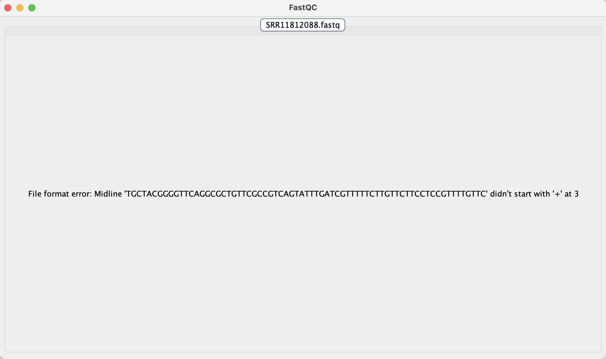

### Last Week
#### 9/9 - 9/13
- finished reading most of the Forsythe 2021 paper
- finished my individual development plan
- practiced more with using github
- learned about the cluster and started the sign up process
- dropped one of my classes (conservation bio) since my courseload was too much

### This Week
#### 9/16 - 9/17
- checked out [whitenose.org](https://www.whitenosesyndrome.org/)
- finished skimming through the rest of the Forsythe 2021 paper
- skimmed through the other 2 WNS papers
- tried to finish setting up cluster account
  - wasn't letting me reset my password for some reason
  - but I might just have to wait a week or so
  
#### 9/18
- downloaded fastQC to laptop
- downloaded a random _P. destructans_ fastq file
  - had some trouble downloading the right file format, but then I figured it out
  - tried to run it through fastQC
  - there was a file format error
- decided it was a great time to start up my lab notebook
  - set up a repository in github
  - figured out how to add r files to my repository
  - figured out how to create r markdown files
  - wrote this r markdown file
  
#### 9/19
- tried to re-run the fastq file through fastQC
  - once again there was a file format error
  - I tried downloading a different fastq file to see if it was just that particular file
  - still recieved the same file format error
  - downloaded it a different way again and still recieved the same file format error
  - unsure of what I am doing wrong or if I need to go in and change the file format?

- watched some [xanadu intro videos](https://github.com/CBC-UCONN/CBC_Docs/wiki/Intro-to-Xanadu-Videos)
  - learned how to use the terminal to sign into the head computer
  - was able to successfully sign in and out of the cluster using the command line

  
  