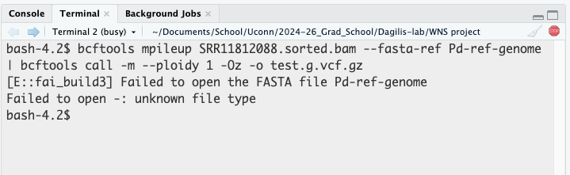

### This Week

#### 10/28

-   led evolution lunch
-   everyone worked on their lab website page during lab meeting

#### 10/29

-   began revising preproposal topic
-   started looking at some more WNS papers

#### 10/30

-   created an excel sheet to better organize the WNS papers I was looking at
-   met with Andrius
    -   need to start thinking about members for my advisory committee
-   tried to work more on the WNS analysis file
    -   struggled a bit to get the picard command to work (got a bit of help from Andrius)
    -   was able to successfully edit the BAM file
    -   was not able to call the genotype
        -   the command was unable to open up the reference genome file I had downloaded
        -   it is very possible I downloaded the ref genome incorrectly
        -   I did try redownloading it (the same way as before) and renaming it to have .fasta at the end of it, but nothing changed

        
        
        
-   also edited my lab member page a little
-   added a bioinformatics resources post on the blog portion of the lab website
